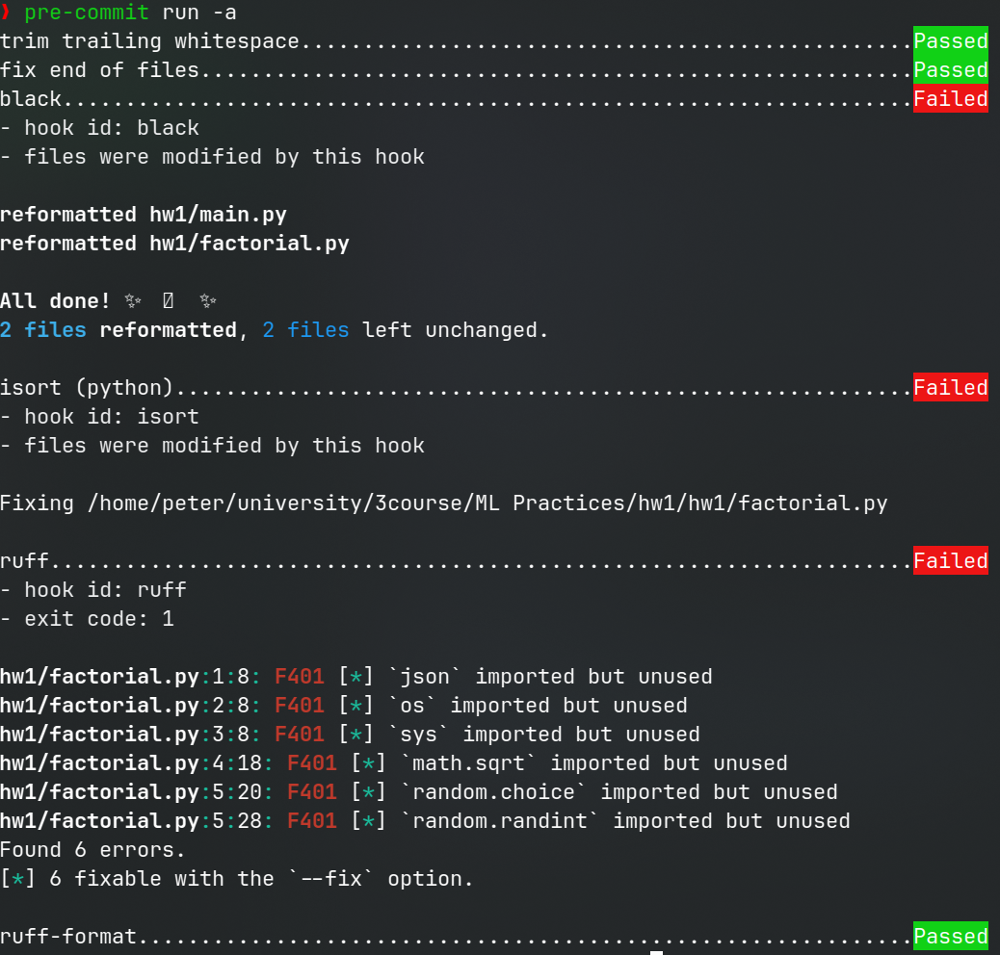
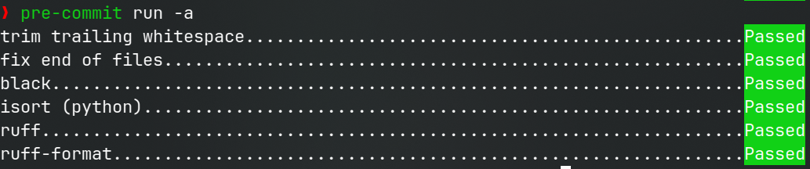

# Ошибки проекта

## Ошибки `black`

```bash
would reformat /home/peter/university/3course/ML Practices/hw1/hw1/main.py
would reformat /home/peter/university/3course/ML Practices/hw1/hw1/factorial.py

Oh no! 💥 💔 💥
2 files would be reformatted, 2 files would be left unchanged.
```

## Ошибки `ruff`

```bash
hw1/factorial.py:1:18: F401 [*] `math.sqrt` imported but unused
hw1/factorial.py:2:8: F401 [*] `os` imported but unused
hw1/factorial.py:3:8: F401 [*] `sys` imported but unused
hw1/factorial.py:4:20: F401 [*] `random.randint` imported but unused
hw1/factorial.py:4:29: F401 [*] `random.choice` imported but unused
hw1/factorial.py:5:8: F401 [*] `json` imported but unused
hw1/factorial.py:9:11: E701 Multiple statements on one line (colon)
Found 7 errors.
[*] 6 fixable with the `--fix` option.
```

## Ошибки `isort`

```bash
ERROR: /home/peter/university/3course/ML Practices/hw1/hw1/factorial.py Imports are incorrectly sorted and/or formatted.
Skipped 2 files
```

## Ошибки `pre-commit` (некоторые дублируются в учебных целях)



## Исправляем и заново запускаем


